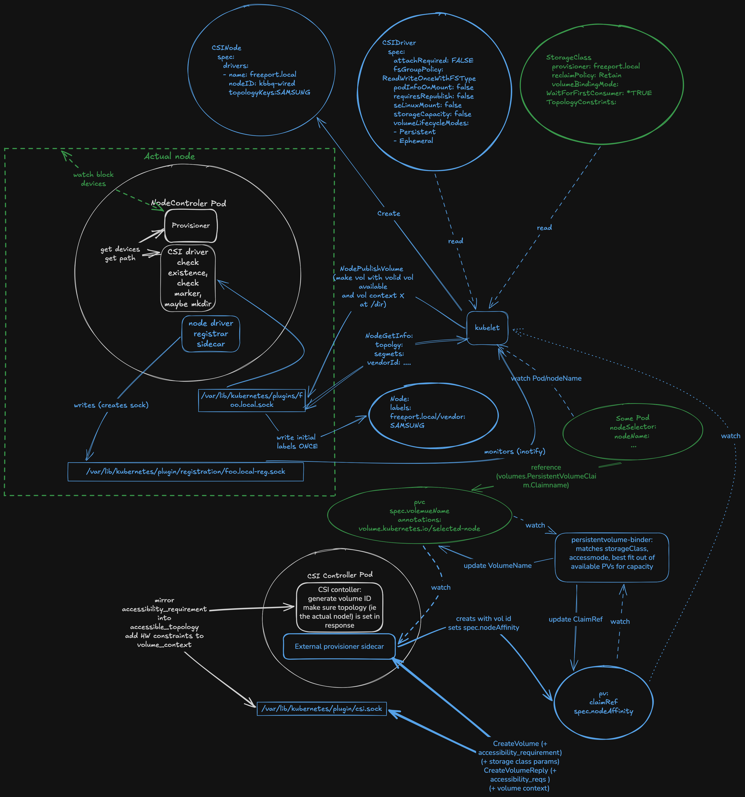

# freeport

A __Experimental__ [Kubernetes StorageClass](https://kubernetes.io/docs/concepts/storage/storage-classes/) provisioner for volumes backed by removable USB drives, implemented as a CSI driver plus a manager (shim) that smooths over CSI/Kubernetes gaps (especially on older versions).

## Design goals

- Give Pods storage on a partition separate from the node's root disk, so Pod volumes can't fill up the node.
- Stay low-dependency: unlike NFS, which needs a network and an NFS server, USB block devices are recognized by stock Linux drivers.
- Let the Kubernetes scheduler place Pods by disk space and topology, instead of the user hand-picking a host path per pod.
- Follow StatefulSet pods across nodes: with node-local storage, a downed node normally strands its Pods; here, moving the USB device to another node lets the Pod migrate with it.

## Design non goals

- Latency/bandwidth: USB devices vary, but none approach best-case storage performance, bounded by USB bus speed.
- Durability: this trades off against the migration goal — colocating Pod and device is convenient, but the device carries no redundancy of its own.

## Alternatives

- [TopoLVM](https://github.com/topolvm/topolvm) is a more robust option and could likely be adapted to these goals.
- Forcing driver-pod restarts to re-register, rather than having the manager edit Kubernetes objects, would likely fix some `NodeGetInfo`-polling gaps (below).

## Detailed design

[CSI](https://kubernetes-csi.github.io/docs/) works roughly as follows. In the diagram, <span style="color:#4285F4">Kubernetes objects, RPCs, and containers provided by Kubernetes or related projects are BLUE</span>. <span style="color:#8a8a8a">Pieces this repo implements are WHITE</span>. <span style="color:#34A853">Things you add to use the driver are GREEN</span> — a StorageClass matching your USB drives' types, and a Pod with a [PVC](https://kubernetes.io/docs/concepts/storage/persistent-volumes/#persistentvolumeclaims) using that StorageClass. (Not shown: the manager also runs as a DaemonSet and edits `CSINode` and PV objects.)


### `csi_driver/cmd/driver` — Node plugin

A DaemonSet (`freeport-csi-driver`), one per node, paired with a `node-driver-registrar` sidecar, serving CSI `Identity` and `Node` over a Unix socket.

- `NodePublishVolume` finds mounted USB devices, matches one against the volume's `VolumeContext` topology segment, mounts `<mountpoint>/<volumeID>` on it, and bind-mounts that into the pod.
- `NodeUnpublishVolume` unmounts and removes the target path, tolerating an already-gone target.
- `NodeGetInfo` reports no `AccessibleTopology` on purpose — the manager owns that.
- Needs `privileged: true`, `hostPID: true`, and the host `/` mounted at `HOST_ROOT` to reach real `/dev`, `/sys`, and `/proc/1/mounts`.

### `csi_driver/cmd/controller` — Controller plugin

A single-replica Deployment (`freeport-csi-controller`) paired with an `external-provisioner` sidecar, serving CSI `Identity` and `Controller`.

- `CreateVolume` provisions nothing directly: it mints a `vol-freeport-<name>` ID, echoes the scheduler's chosen topology segment into `VolumeContext` for the node plugin to match on later, and is idempotent by name/capacity.
- `ControllerPublishVolume`/`UnpublishVolume` are no-ops (`attachRequired: false`).

### `csi_driver/cmd/manager` — Topology/migration manager

A DaemonSet (`freeport-manager`), one per node, running a reconcile loop against the Kubernetes API and host filesystem:

1. **Discover and mount** USB devices, retrying and clearing stale mountpoints.
2. **Label the Node** `freeport.local/<manufacturer>-<model>=true` per mounted device class.
3. **Sync CSINode topology keys** by removing and re-adding the driver's `CSINodeDriver` entry (retrying on conflict), since `TopologyKeys` can't be edited in place.
4. **Migrate volumes**: if a device turns up on a node other than its PV's pinned `nodeAffinity`, and a pod bound to that claim is scheduled elsewhere, the manager strips the PV's finalizers, recreates it pinned to the current node, and deletes the misplaced pod so it reschedules.
5. **Repair read-only mounts** — a device that mounts read-only (usually from an unclean unplug) gets `fsck -f -y` and a remount.

## Running the whole stack

### Unit tests

```sh
cd csi_driver
go test ./pkg/driver/... ./pkg/manager/...
```

### locally (Tilt)

`Tiltfile.tilt` builds the three images (`freeport-csi-controller`, `freeport-csi-driver`, `freeport-manager`) and deploys a kustomize overlay (`KUSTOMIZE_DIR`, defaults to `kustomize/base`).

Example usage:

```sh
tilt up --file Tiltfile.tilt
```

### Through kustomize/kubectl

```sh
kubectl apply -k kustomize/base
```

### End-to-end tests (chainsaw)

`test/chainsaw/*` needs a real cluster with real USB hardware — no mocked driver exists for these.

Copy `test/chainsaw/values.yaml.example` to `values.yaml` and set `storageClassName`/`narrowStorageClassName` for your cluster first; there's no fallback, so a missing file fails loudly.

```sh
cd test/chainsaw
chainsaw test --values values.yaml
```

Tests included:

- `basic-provisioning` — PVC binds, pod reads/writes the volume.
- `topology-followed-broad` — bound PV carries the right `freeport.local/*` nodeAffinity, using a StorageClass every node currently qualifies for.
- `topology-followed-narrow` — same, but with a StorageClass only one node satisfies.
- `ephemeral-inline-volume` — exercises the CSI ephemeral (inline `csi:` volume) mode, bypassing PVC/PV/scheduling entirely.


## Learnings

### Workflow

Claude tended to spawn extra branches, structs, and changes beyond what was asked, which slowed things down; some code stayed hand-written, and most Claude output got a close review pass to keep it debuggable. Next time, lean harder on `CLAUDE.md` or write more of it by hand.

### Design

CSI had sharp edges that added complexity:

- `NodeGetInfo` runs once, with no mechanism to re-poll it, so it can't track topology changes. It seeds `CSINode`'s `driver.TopologyKeys`, which then goes stale whenever a USB device type is added or removed.
  - A [beta feature](https://kubernetes.io/blog/2025/09/11/kubernetes-v1-34-mutable-csi-node-allocatable-count/) touches this area but doesn't cover mutating topology keys.
- Node labels come from the same one-shot `NodeGetInfo` call, so scheduler-visible storage labels can't update dynamically either.
- `PersistentVolume.nodeAffinity` and `CSINode.driver.TopologyKeys` are both immutable, forcing delete-and-recreate to change them.
  - [Mutable PV node affinity](https://kubernetes.io/blog/2026/01/08/kubernetes-v1-35-mutable-pv-nodeaffinity/) exists but is Alpha and opt-in.
- Topology selectors don't support wildcards, so each StorageClass must list every USB model/manufacturer explicitly.

### Other bugs

Avoidable in hindsight:

- The mount code once tried to mount a USB-resident swap partition.
- Unplugging devices mid-use left dirty filesystems that needed `fsck` before remounting.

